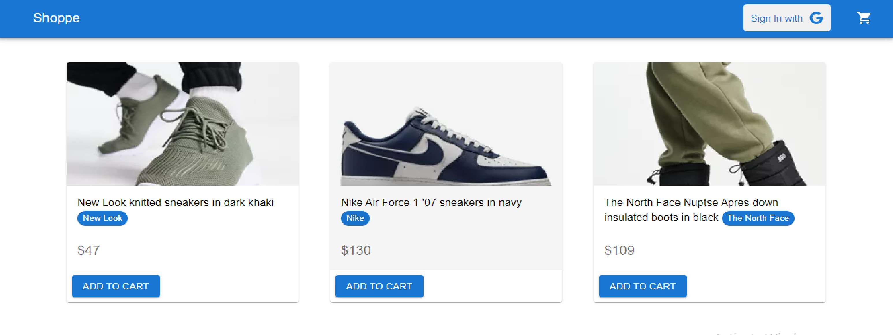

# Shoppe

Simple ecommerce application.

## Description

A simple and small ecommerce application. Users can view products and can add products to cart and can checkout. Include authentication and stripe payment.

## Getting Started
```
git clone git@github.com:Htetaungkyaw71/Ecommerce.git
```
### Screenshot


### Live demo

* Shoppe
[@Link](https://shoppe-eltm.onrender.com/)

### Technologies
* React
* Redux
* Firebase
* Material ui
* stripe api
* asos api


### Installing
```
 npm install
```

### Executing program

* How to run the program
```
npm run
```


## Authors

* Htetaungkyaw
[@Htetaungkyaw](https://github.com/Htetaungkyaw71)


## License

This project is licensed under the [NAME HERE] License - see the LICENSE.md file for details
